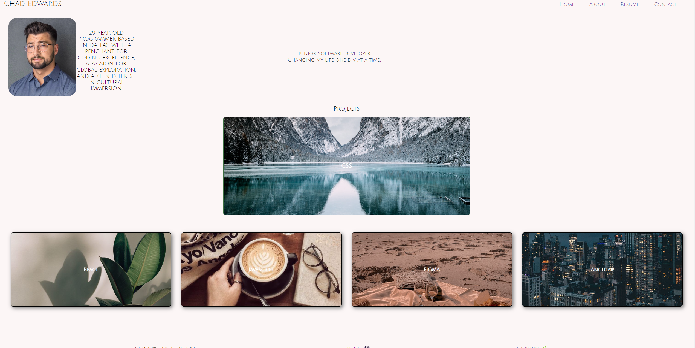

# chadedwards-portfolioV1

## Chad Edwards Portfolio
This website serves to be a first impression for any user wanting to get a sample of what I have to offer. 
I wanted you as the user to be able to navigate through my page by selecting the navigation bar to go to each section you'd prefer. On this website you will find deployable links to each project I have worked on with a focus in the language I used to build the application. This includes projects in HTML, CSS, JavaScript, Angular and Figma.
At the bottom of the page you will find my contact info with deployable links to my GitHub and LinkedIn profile.

## Link to Website :

## Screenshot of Website :

## Credit
All techniques used in this website are derived from SMU Coding Boot Camp, Online Internet Resources and reddit.

## Update :
Last Updated 9/17/2023